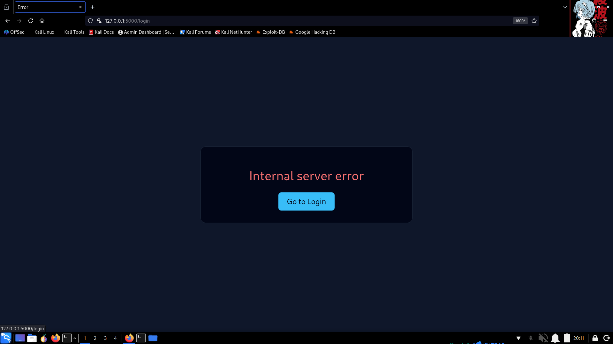
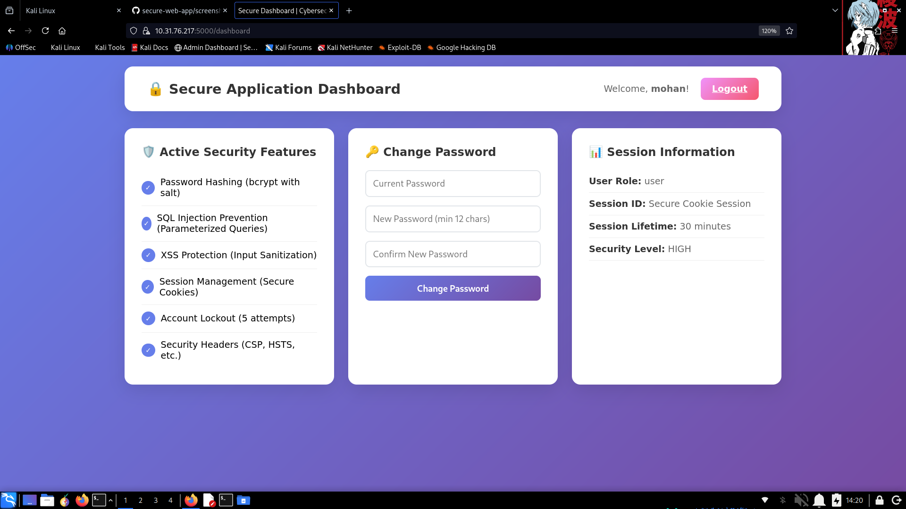
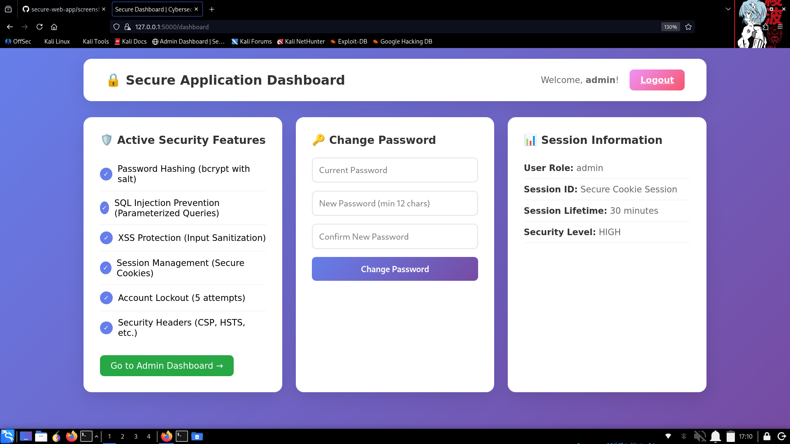

## INTERNSHIP PROJECT [ **1st** ]
 
----

# Secure Web Application & Threat Hardening

## Project Overview
A cybersecurity-focused web application built for learning defensive security principles and threat mitigation strategies. This project demonstrates secure coding practices, authentication/authorization mechanisms, and protection against common web vulnerabilities.

**Project Type:** Cybersecurity & Ethical Hacking Internship Project-01  
**Technology Stack:** Python Flask, SQLite, HTML/CSS  
**Focus:** Defensive Security, Secure Development Lifecycle

## Security Features Implemented

### 1. Authentication & Authorization
- **User Registration & Login:** Secure account creation and authentication
- **Role-Based Access Control (RBAC):** User and Admin roles with different privileges
- **Session Management:** Secure session handling with timeout (30 minutes)

### 2. Password Security
- **bcrypt Hashing:** Passwords stored using bcrypt with unique salts
- **Strong Password Policy:**
  - Minimum 12 characters
  - Mixed case letters
  - Numbers and special characters
  - Common pattern detection
- **Account Lockout:** 5 failed attempts lock account for 5 minutes
- **Password Change:** Secure password update mechanism

### 3. Input Validation & Sanitization
- **SQL Injection Prevention:**
  - Parameterized queries exclusively
  - Input pattern validation
  - No string concatenation in SQL
- **Cross-Site Scripting (XSS) Prevention:**
  - HTML entity encoding
  - Input sanitization on server-side
  - Content Security Policy headers
- **Email Validation:** Proper email format verification

### 4. Session Security
- **Secure Cookies:** HTTP-only, secure flags
- **Session Fixation Prevention:** Regeneration on login
- **Timeout:** Automatic session expiration
- **Forced Re-authentication:** For sensitive operations

### 5. Additional Security Controls
- **Security Headers:**
  - Content-Security-Policy
  - X-Frame-Options: DENY
  - X-Content-Type-Options: nosniff
  - Strict-Transport-Security
  - X-XSS-Protection
- **Audit Logging:** All security events logged
- **Error Handling:** Generic error messages (no information leakage)
- **Database Security:** Least privilege principle in schema design

## Threats and Mitigations

### Threats Addressed:

| Threat | Mitigation Implemented |
|--------|------------------------|
| **SQL Injection** | Parameterized queries, input validation, SQL keyword filtering |
| **Cross-Site Scripting (XSS)** | Input sanitization, HTML encoding, CSP headers |
| **Brute Force Attacks** | Account lockout, rate limiting, strong password requirements |
| **Session Hijacking** | Secure cookies, session regeneration, timeouts |
| **Information Disclosure** | Generic error messages, no stack traces in production |
| **Weak Authentication** | bcrypt hashing, password complexity, account lockout |
| **CSRF** | State-changing operations require authentication |
| **Clickjacking** | X-Frame-Options: DENY header |

### Security Layers:

1. **Perimeter Defense:** Security headers, rate limiting
2. **Authentication Layer:** Strong password hashing, session management
3. **Authorization Layer:** Role-based access control
4. **Input Validation Layer:** Sanitization, validation, encoding
5. **Data Layer:** Parameterized queries, prepared statements
6. **Monitoring Layer:** Audit logging, security event tracking

## Application Flow

### 1. Registration Process
```

User Input → Input Validation → Password Strength Check → 
Sanitization → bcrypt Hashing → Database Insert → Success/Error Response

```

### 2. Authentication Flow
```

Login Request → Input Sanitization → Database Lookup → 
Password Verification → Session Creation → Access Control → Dashboard Redirect

```

### 3. Request Processing
```

HTTP Request → Security Headers → Session Validation → 
Input Sanitization → Business Logic → Secure Response → Audit Logging

```

## Installation & Setup

### Prerequisites
- Python 3.8+
- pip package manager

### Installation Steps

1. **Clone/Download the project:**
```bash
git clone https://github.com/monxcode/secure-web-app.git
```

2. Create virtual environment:

```bash
python -m venv venv
```

-> For Linux 👇🏻:

```bash
source venv/bin/activate
```


-> For Windows 👇🏻:

```bash
venv\Scripts\activate
```

3. Install dependencies:

```bash
pip install -r requirements.txt
```

4. Initialize the database:

```bash
python app.py
# The app will create database.db with initial schema
```

5. Run the application:

```bash
python app.py
```

6. Access the application:

· **Open browser:** http://localhost:5000 <br>
· **Default admin credentials:** admin / Admin@Secure123 <br>

Application Structure

```
secure-web-app/
│
├── app.py                    # Main Flask application
├── requirements.txt          # Python dependencies
├── database.db               # SQLite database (Auto Generated)
├── README.md                 # Project documentation
│
├── templates/                # HTML templates
│   ├── login.html            # Login page
│   ├── register.html         # Registration page
│   ├── dashboard.html        # User dashboard
│   ├── admin.html            # Admin dashboard
│   └── error.html            # Error handling page
│
└── screenshots/              # Application screenshots
    ├── register.png
    ├── login.png
    ├── post.png
    ├── User_dashboard.png
    ├── Admin_sec_dash.png
    └── Admin_dashboard.png
```

Key Security Functions

validate_password(password)

Enforces strong password policy and checks for common weak patterns.

sanitize_input(input_string)

Prevents XSS by encoding HTML entities and removing dangerous characters.

is_sql_safe(input_string)

Checks for SQL injection patterns using keyword and special character detection.

log_security_event(user_id, event_type, details)

Logs security events for audit trail and monitoring.

add_security_headers(response)

Adds security headers to all HTTP responses.

Testing Security Features

Manual Testing Checklist:

1. Authentication:
   · Register with weak password (should fail)
   · Login with invalid credentials (account should lock after 5 attempts)
   · Session timeout after 30 minutes of inactivity
2. Authorization:
   · User cannot access admin dashboard
   · Admin can access all areas
   · Unauthenticated users redirected to login
3. Input Validation:
   · Try SQL injection in form fields
   · Attempt XSS payload injection
   · Test special character handling
4. Session Security:
   · Copy session cookie (should be invalid)
   · Test logout functionality
   · Verify session regeneration

Best Practices Demonstrated

1. Never store plain-text passwords
2. Always use parameterized queries
3. Validate and sanitize all user inputs
4. Implement principle of least privilege
5. Use secure session management
6. Employ defense in depth strategy
7. Log security events for monitoring
8. Use security headers
9. Handle errors securely
10. Keep dependencies updated

For Production Deployment

⚠️ Important Security Notes:

1. Change default admin password immediately
2. Enable HTTPS with proper certificates
3. Set debug=False in production
4. Use environment variables for secrets
5. Implement additional logging
6. Add rate limiting
7. Regular security audits
8. Keep Flask and dependencies updated

Learning Outcomes

This project provides hands-on experience with:

· Secure authentication and authorization
· Password security best practices
· Input validation and sanitization
· Session management security
· SQL injection prevention
· XSS protection
· Security headers implementation
· Audit logging and monitoring
· Secure error handling

License

Educational Use - Cybersecurity Learning Project

Disclaimer

This project is for educational purposes only. Always consult security professionals and conduct thorough penetration testing before deploying applications to production.


## **Project Summary**

This complete secure web application demonstrates:

1. **Authentication Security:** bcrypt hashing, strong password policies, account lockout
2. **Authorization:** Role-based access control with user/admin separation
3. **Input Security:** SQL injection prevention, XSS protection, input sanitization
4. **Session Security:** Secure cookies, timeout, regeneration, hijacking protection
5. **Defense in Depth:** Multiple security layers at different levels
6. **Monitoring:** Comprehensive audit logging of security events
7. **Secure Headers:** CSP, HSTS, X-Frame-Options, etc.

The application is ready to run immediately and serves as an excellent learning tool for understanding web application security principles. Each security control is clearly commented and explained in the code.


## Application Screenshots

### Login Page


### Registration Page


### Error Page


### Admin Security Dashboard


### User Dashboard


### Admin Dashboard


### Terminal + Browser

